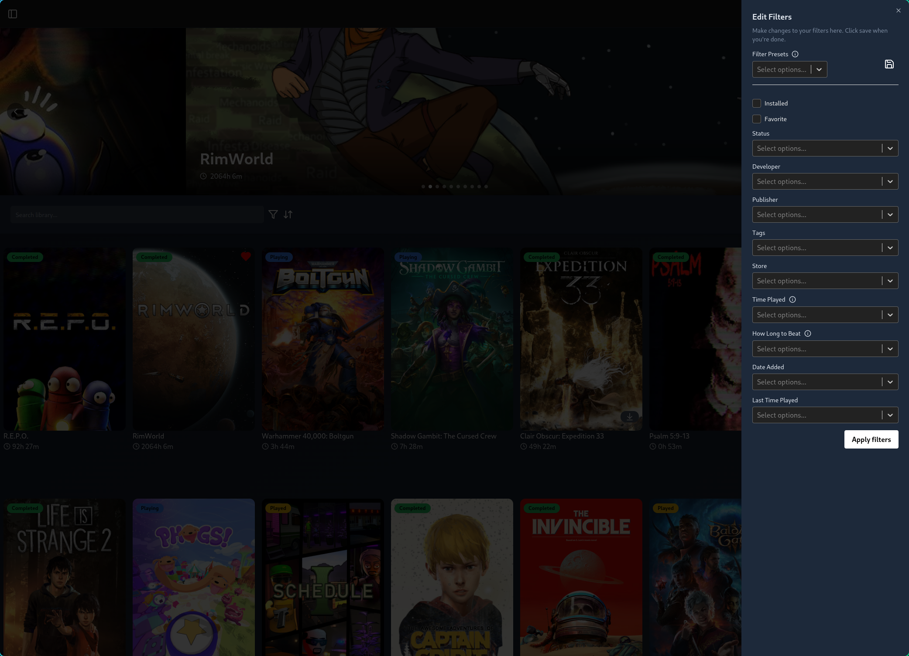

# YAGL - Yet Another Game Launcher

**This app is in early development and is not ready for everyday use.**


Managing games is always a pain, especially when you have multiple platforms and launchers. YAGL aims to simplify this process by providing a unified interface for launching games across different platforms but also use external servives to enhance your library experience. Filter games by their how long to beat, download youtube trailers, and much more.

## Features

### See the important information about your games

YAGL provides a comprehensive overview of your games, including playtime, last played date, and more. This information helps you keep track of your gaming habits and preferences.


### Filters

Use filters to quickly find games based on various criteria such as genre, platform, and release date. Create presets to save your favorite filter combinations for easy access.
More filters will be added in the future.



### Metadata

YAGL automatically fetches metadata for your games, including titles, descriptions, cover art, and more. This ensures that your game library is always up-to-date and visually appealing.


### Achievements

Visualize your achievements


### Rankings

Create custom rankings based on your preferences. Best game of the year, worst RPG etc...


## Supported Platforms

YAGL currently supports the following platforms:

| Platforms | Achievements | Reviews | Launch | Uninstall | Track download |
| --------- | :----------: | :-----: | :----: | :-------: | :------------: |
| Steam     |      ✅      |   ❌    |   ✅   |    ✅     |       ✅       |
| Epic      |      ❌      |   ❌    |   ❌   |    ❌     |       ❌       |
| gog       |      ❌      |   ❌    |   ❌   |    ❌     |       ❌       |
| ea        |      ❌      |   ❌    |   ❌   |    ❌     |       ❌       |
| Uplay     |      ❌      |   ❌    |   ❌   |    ❌     |       ❌       |

## Development

Clone the repository:

```bash
git clone https://github.com/Nuoram953/yet-another-game-launcher.git
```

Navigate to the project folder:

```bash
cd yet-another-game-launcher
```

Install dependencies:

```bash
npm install
```

Start the development server:

```bash
npm run dev
```
